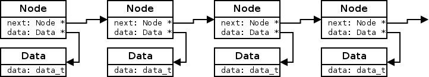
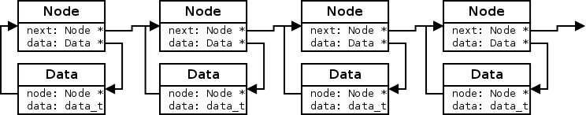
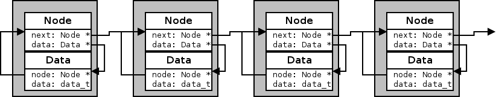
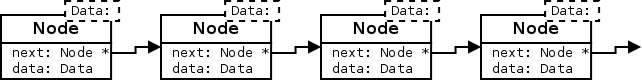
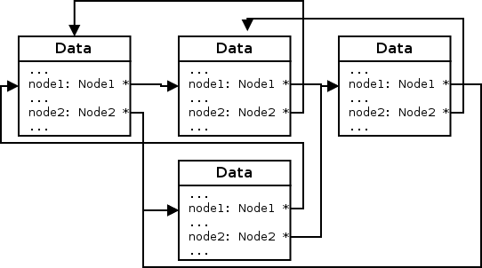

# Building-Blocks - Generic Container

Most data structures are largely independent of the data stored in
them. A list can be used to store a number of integers, doubles,
threads or even other lists. While the details in each case might
differ the overall structure and code is always the same. Lists,
Trees, Sets, Maps, Hashtabels are all generic containers.

Containers can be implemented in various ways. Each has its own
benefits and drawbacks. Here are a few (using a single linked list as
example):

Detached
--------

In a detached container the data structures control structure (Node)
is detached from them payload (Data). The Nodes only contain a pointer
to the data itself but no actual data.

Nodes are always the same size no matter how large the data is. The
data an node points to can also be easily swapped for another. All it
needs it setting the pointer, which can be done atomically. One
problem is that this link is unidirectional. Given a Data structure
there is no way to get the Node that points to it. Therefore you
sometimes see links from the Data back to its Node:

Since now there are two links swapping nodes is no longer atomic and
in a multi-threaded environment care must be taken to avoid race
conditions.

The detached control structure has a drawback though. It needs to be
separately allocated, causing two allocations per data. Sometimes this
is a plus though. The data can have special requirements on alignment
or be allocated from somewhere else that makes using a joined or
internal container impractical.

Joined
------

A drawback of the detached container are the separate allocations. But
why should one do 2 allocations just because there are 2 structures?
One can just allocate a larger chunk and put both of them in there:

This half's the number of allocations needed while still meaning that
moving Data between Nodes is just changing 2 pointers. There will
always be exactly as many Nodes and Data (or an integer multiple if
one allocates space for n Nodes per Data). Freeing an Node or Data
becomes a little more complex since they can only be freed in
pairs. If the Data has been shuffled around between the Nodes then the
Node in the same block as the Data might not be linked. But usually
the Node is still small and exchanging the Node in the same block as
the Data for the Node the Data points to is easy. And once exchange
the block can be freed as one. If the shuffling of Data between Nodes
is not required the pointers between Node and Data can be omitted and
simple pointer arithmetic can be used to go from one to the other.

External
--------

Taking the joined thing one step further one can make the Data part of
the actual Node structure itself. This means that for every type of
Data there needs to be a different type of Node. This requires the use
of macros or templates. The clear advantage is that different kinds of
lists can't be accidentally mixed. The compiler would give type errors.

Internal
--------

While the external container had the Data as part of the Node
structure one can also go the other way and have the Node as part of
the Data structure. The advance over the external approach is that a
struct Data can have multiple struct Node and therefor be in multiple
containers at the same time. For example it could be in a tree where
all Nodes of the same level are also in a linked list so moving
sideways in the tree is fast.

Unlike with the external approach (or joined without Node/Data
pointers) switching between the container(s) and Data needs a bit more
care. The struct Node can be anywhere in struct Data so to get from
one to the other and back the offset of struct Node within struct Data
has to be known. I prefer to have this as part of the type of the
struct Node. The advantage is not only that the compiler will type
check the correct usage but also the functions to move within a
container don't require the offset as additional argument and can't be
given the wrong offset by accident. The pointers used in struct Node
can also point to the struct Data or the struct Node. Pointing at the
struct Data is generally simpler.
